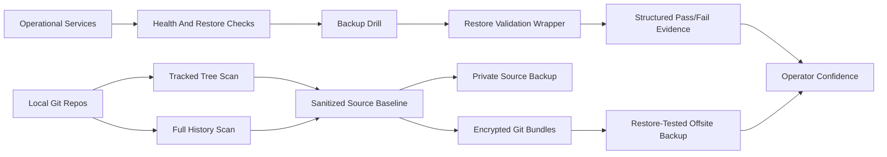

# Reliability Remediation Flow

The pattern is deliberately simple:

1. Find the places where the system can silently lie.
2. Make the check produce explicit evidence.
3. Separate source from generated/private state.
4. Verify recovery from the artifact that would be used in an outage.
